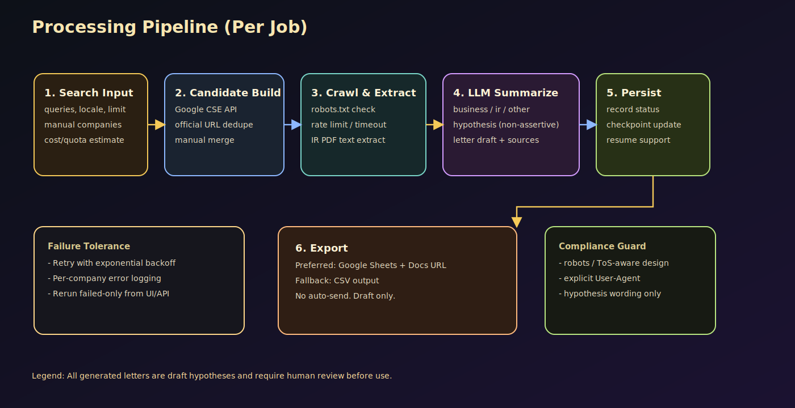

# CompanyIntel Letter Builder

FastAPI + PostgreSQL + Next.js で構成した、企業調査と提案文下書き生成アプリです。  
要件に合わせて以下を実装しています。

- Google Custom Search API による企業候補抽出（API未設定時はエラーを明示）
- 企業HP/IRページ/PDFの収集（robots配慮、レート制限、タイムアウト）
- LLM要約・仮説生成（OpenAI/Anthropic 抽象化、未設定時は mock フォールバック）
- Google Sheets + Google Docs 出力、または CSV 出力
- 途中失敗時の再開（失敗企業のみ再実行）
- FastAPI CRUD: `/api/companyintel-letter-builder`

## アーキテクチャ図


## 処理フロー図



## ディレクトリ構成

```text
.
├── backend
│   ├── alembic
│   │   ├── env.py
│   │   └── versions/0001_create_company_intel_tables.py
│   ├── app
│   │   ├── api/routes/companyintel_letter_builder.py
│   │   ├── core/config.py
│   │   ├── db/session.py
│   │   ├── models/company_intel_job.py
│   │   ├── repositories/company_intel.py
│   │   ├── schemas/company_intel.py
│   │   └── services/
│   ├── config.yaml.example
│   ├── main.py
│   ├── pyproject.toml
│   └── requirements.txt
├── frontend
│   ├── app/page.tsx
│   ├── lib/api.ts
│   ├── package.json
│   └── types/companyintel.ts
└── README.md
```

## 前提

- Python 3.12 推奨（3.11 でも概ね可）
- Node.js 20+
- PostgreSQL 15+

## バックエンド起動手順

```bash
cd backend
python3 -m venv .venv
source .venv/bin/activate
pip install -r requirements.txt
cp .env.example .env
```

`.env` を編集して最低限以下を設定:

- `DATABASE_URL=postgresql+asyncpg://...`
- Google検索を使う場合: `GOOGLE_CUSTOM_SEARCH_API_KEY`, `GOOGLE_CUSTOM_SEARCH_CX`
- Google出力を使う場合: `GOOGLE_SERVICE_ACCOUNT_FILE`
- LLMを使う場合: `OPENAI_API_KEY` または `ANTHROPIC_API_KEY`

### DBマイグレーション

DBが存在しない場合は先に作成:

```bash
# psql が使える場合
psql -U postgres -h localhost -d postgres -c "CREATE DATABASE companyintel;"
```

その後にマイグレーション:

```bash
cd backend
alembic upgrade head
```

### APIサーバ起動

```bash
cd backend
uvicorn app.main:app --reload --port 8000
```

疎通確認:

```bash
curl -s http://127.0.0.1:8000/healthz
```

## フロント起動手順

```bash
cd frontend
cp .env.local.example .env.local
npm install
npm run dev
```

ブラウザ:

- `http://localhost:3000`

## API疎通確認（curl）

### 1) ジョブ作成

```bash
curl -X POST 'http://127.0.0.1:8000/api/companyintel-letter-builder' \
  -H 'Content-Type: application/json' \
  -d '{
    "name": "Sample Batch",
    "search": {
      "search_queries": ["渋谷 IT 受託開発"],
      "limit": 5,
      "locale": "ja-JP",
      "manual_companies": []
    },
    "output": {
      "mode": "csv",
      "worksheet": "companies",
      "docs_output": false,
      "csv_path": "./output/companyintel_output.csv"
    },
    "llm": {
      "provider": "mock",
      "model": "gpt-4o-mini",
      "temperature": 0.2
    },
    "crawling": {
      "max_pages_per_site": 3,
      "obey_robots": true,
      "rate_limit_sec": 2,
      "request_timeout_sec": 15
    },
    "run_async": true
  }'
```

### 2) ジョブ一覧（boolean/enum は文字列で指定）

```bash
curl -s 'http://127.0.0.1:8000/api/companyintel-letter-builder?status=running&has_failures=false&include_records=true'
```

### 3) ジョブ詳細

```bash
curl -s 'http://127.0.0.1:8000/api/companyintel-letter-builder/{job_id}?include_records=true'
```

### 4) 失敗分のみ再実行

```bash
curl -X PATCH 'http://127.0.0.1:8000/api/companyintel-letter-builder/{job_id}' \
  -H 'Content-Type: application/json' \
  -d '{"rerun_failed_only": true}'
```

## CLI バッチ実行

```bash
cd backend
cp config.yaml.example config.yaml
python3 main.py --config config.yaml
```

テーブル未作成の場合だけ簡易初期化:

```bash
python3 main.py --config config.yaml --init-db
```

## テスト

```bash
cd backend
pytest tests/test_parsers.py tests/test_llm_service.py
```

## 運用上の注意

- スクレイピング対象は企業公式サイトとIR関連に限定し、`robots.txt` を尊重する設計です。
- 手紙は仮説ドラフトのみ生成し、自動送信は行いません。
- 生成文は必ず人手レビューしてください。

## トラブルシュート

### 1) フロント起動時 `EADDRINUSE: 3000`

`3000` が既存プロセスに使用されています。  
空けるか、別ポートで起動してください。

```bash
# 3000を使っているプロセス確認
lsof -nP -iTCP:3000 -sTCP:LISTEN

# 例: PID 20703 を停止
kill 20703

# 代替: 別ポートで起動
npm run dev -- -p 3001
```

### 2) `zsh: command not found: alembic`

仮想環境が有効化されていません。`backend` 配下で以下を実行してください。

```bash
cd backend
source .venv/bin/activate
PYTHONPATH=. alembic upgrade head
PYTHONPATH=. uvicorn app.main:app --reload --port 8000
```
